# ER図 Mermaid版

## 1. ER図

以下をMermaid対応エディタ、GitHub Markdown、またはMermaid Live Editorで表示する。

```mermaid
erDiagram
    roles ||--o{ users : has
    users ||--o| student_profiles : has
    users ||--o| teacher_profiles : has

    exams ||--o{ questions : has
    question_categories ||--o{ questions : classifies
    users ||--o{ questions : creates
    questions ||--o{ question_choices : has

    users ||--o{ daily_qa_answers : answers
    questions ||--o{ daily_qa_answers : used_in
    question_choices ||--o{ daily_qa_answers : selected

    users ||--o{ practice_sessions : starts
    exams ||--o{ practice_sessions : for
    practice_sessions ||--o{ practice_answers : contains
    questions ||--o{ practice_answers : answered
    question_choices ||--o{ practice_answers : selected

    exams ||--o{ mock_exams : has
    users ||--o{ mock_exams : creates
    mock_exams ||--o{ mock_exam_questions : contains
    questions ||--o{ mock_exam_questions : included

    mock_exams ||--o{ mock_attempts : attempted_by
    users ||--o{ mock_attempts : takes
    mock_attempts ||--o{ mock_answers : contains
    questions ||--o{ mock_answers : answered
    question_choices ||--o{ mock_answers : selected

    users ||--o{ point_transactions : earns
    users ||--o{ user_titles : owns
    titles ||--o{ user_titles : owned_by
    titles ||--o{ student_profiles : equipped_as

    users ||--o{ monthly_rankings : ranked
    users ||--o{ board_posts : writes
    board_posts ||--o{ board_comments : has
    users ||--o{ board_comments : comments

    users ||--o{ announcements : creates
    notifications ||--o{ user_notifications : delivered_as
    users ||--o{ user_notifications : receives
    users ||--o{ audit_logs : acts

    roles {
        uuid id PK
        varchar name UK
        text description
        timestamp created_at
        timestamp updated_at
    }

    users {
        uuid id PK
        uuid auth_user_id UK
        uuid role_id FK
        varchar email UK
        varchar display_name
        varchar status
        timestamp last_login_at
        timestamp created_at
        timestamp updated_at
        timestamp deleted_at
    }

    student_profiles {
        uuid user_id PK,FK
        varchar student_no UK
        text avatar_url
        text bio
        uuid current_title_id FK
        integer total_points
        integer total_practice_count
        integer total_correct_count
        integer total_answer_count
        timestamp created_at
        timestamp updated_at
    }

    teacher_profiles {
        uuid user_id PK,FK
        varchar teacher_no UK
        varchar department
        text avatar_url
        timestamp created_at
        timestamp updated_at
    }

    exams {
        uuid id PK
        varchar code UK
        varchar name
        text description
        boolean is_active
        timestamp created_at
        timestamp updated_at
    }

    question_categories {
        uuid id PK
        varchar code UK
        varchar name
        integer sort_order
        timestamp created_at
        timestamp updated_at
    }

    questions {
        uuid id PK
        uuid exam_id FK
        uuid category_id FK
        integer source_year
        varchar source_season
        integer question_no
        text question_text
        text explanation
        varchar question_type
        integer difficulty
        varchar status
        uuid created_by FK
        timestamp created_at
        timestamp updated_at
        timestamp deleted_at
    }

    question_choices {
        uuid id PK
        uuid question_id FK
        varchar choice_label
        text choice_text
        boolean is_correct
        integer sort_order
        timestamp created_at
        timestamp updated_at
    }

    daily_qa_answers {
        uuid id PK
        uuid user_id FK
        uuid question_id FK
        uuid selected_choice_id FK
        boolean is_correct
        date answer_date
        timestamp answered_at
        boolean answer_point_awarded
        boolean correct_point_awarded
        timestamp created_at
    }

    practice_sessions {
        uuid id PK
        uuid user_id FK
        uuid exam_id FK
        varchar status
        integer question_count
        integer answered_count
        integer correct_count
        integer earned_points
        timestamp started_at
        timestamp completed_at
        timestamp created_at
        timestamp updated_at
    }

    practice_answers {
        uuid id PK
        uuid session_id FK
        uuid question_id FK
        uuid selected_choice_id FK
        boolean is_correct
        integer order_no
        timestamp answered_at
        timestamp created_at
    }

    mock_exams {
        uuid id PK
        uuid exam_id FK
        varchar title
        date target_month
        text description
        integer time_limit_minutes
        integer question_count
        varchar status
        timestamp available_from
        timestamp available_until
        uuid created_by FK
        timestamp created_at
        timestamp updated_at
    }

    mock_exam_questions {
        uuid id PK
        uuid mock_exam_id FK
        uuid question_id FK
        integer order_no
        integer score
        timestamp created_at
    }

    mock_attempts {
        uuid id PK
        uuid mock_exam_id FK
        uuid user_id FK
        varchar status
        timestamp started_at
        timestamp submitted_at
        integer total_questions
        integer correct_count
        integer score
        integer earned_points
        timestamp created_at
        timestamp updated_at
    }

    mock_answers {
        uuid id PK
        uuid attempt_id FK
        uuid question_id FK
        uuid selected_choice_id FK
        boolean is_correct
        integer score_awarded
        timestamp answered_at
        timestamp created_at
    }

    point_transactions {
        uuid id PK
        uuid user_id FK
        integer points
        varchar reason
        varchar source_type
        uuid source_id
        date transaction_date
        text description
        timestamp created_at
    }

    titles {
        uuid id PK
        varchar name UK
        text description
        integer price_points
        varchar rarity
        boolean is_active
        integer sort_order
        timestamp created_at
        timestamp updated_at
    }

    user_titles {
        uuid id PK
        uuid user_id FK
        uuid title_id FK
        timestamp purchased_at
        timestamp equipped_at
        timestamp created_at
    }

    monthly_rankings {
        uuid id PK
        date target_month
        uuid user_id FK
        integer rank_no
        integer monthly_points
        integer mock_score
        integer reward_points
        timestamp calculated_at
        timestamp created_at
    }

    board_posts {
        uuid id PK
        uuid author_id FK
        varchar title
        text body
        varchar category
        varchar status
        integer comment_count
        timestamp last_commented_at
        timestamp created_at
        timestamp updated_at
        timestamp deleted_at
    }

    board_comments {
        uuid id PK
        uuid post_id FK
        uuid author_id FK
        text body
        varchar status
        timestamp created_at
        timestamp updated_at
        timestamp deleted_at
    }

    announcements {
        uuid id PK
        varchar title
        text body
        varchar status
        timestamp published_at
        uuid created_by FK
        timestamp created_at
        timestamp updated_at
    }

    notifications {
        uuid id PK
        varchar type
        varchar title
        text body
        varchar source_type
        uuid source_id
        timestamp created_at
    }

    user_notifications {
        uuid id PK
        uuid notification_id FK
        uuid user_id FK
        timestamp read_at
        timestamp created_at
    }

    audit_logs {
        uuid id PK
        uuid actor_id FK
        varchar action
        varchar target_type
        uuid target_id
        jsonb metadata
        timestamp created_at
    }
```

## 2. 主な関係

| 関係 | 内容 |
|---|---|
| roles 1 - n users | 1つのroleに複数ユーザー |
| users 1 - 1 student_profiles | 学生ユーザーは学生プロフィールを持つ |
| users 1 - 1 teacher_profiles | 教師ユーザーは教師プロフィールを持つ |
| exams 1 - n questions | 1つの試験に複数問題 |
| questions 1 - n question_choices | 1問に複数選択肢 |
| users 1 - n practice_sessions | 学生は複数回練習できる |
| practice_sessions 1 - n practice_answers | 練習1回に複数回答 |
| mock_exams 1 - n mock_attempts | 模擬試験は複数学生が受験 |
| users 1 - n point_transactions | ユーザーごとにポイント履歴 |
| users n - n titles | user_titlesを通して称号所持 |
| users 1 - n monthly_rankings | 月別ランキングにユーザーが登録される |
| board_posts 1 - n board_comments | 投稿にコメントが付く |
