# Codex向けプロジェクト指示書 一括版

このファイルは、分割したCodex向けMarkdown指示書を1つにまとめたものです。


---

# File: 00_README_Codex_Instruction.md

# Codex向け指示書 README

## 目的

このフォルダは、資格試験学習アプリを実装するために、Codexへ読ませる前提資料である。  
これまでのチャットで整理した最新方針を、実装しやすいMarkdown形式に再整理している。

## プロジェクト概要

学生が **ITパスポート** と **基本情報技術者試験** の過去問を学習できるWebアプリを作成する。  
通常の過去問練習だけではなく、**一問一答、模擬試験、ランキング、ポイント、称号ショップ、掲示板、教師管理機能** を持つ。

学習のモチベーション維持のため、特に **ポイント機能** と **称号機能** を重要機能として扱う。

## 技術スタック

| 区分 | 採用技術 |
|---|---|
| フロントエンド | Next.js / React / Tailwind CSS |
| バックエンド | Next.js API Routes / Route Handlers |
| DB | Supabase PostgreSQL |
| ORM | Prisma |
| 認証 | Supabase Authを想定。ただし、アプリ側ではusers/profilesで管理する |
| ホスティング | Vercel |
| 開発方針 | バックエンド・DBから先に実装する |

## 重要な前提

- PrismaはDBを直接入力する道具ではなく、Next.js APIからDBへアクセスするためのORMとして使う。
- 画面からDBへ直接アクセスしない。必ずNext.js APIを通す。
- 掲示板はリアルタイムチャットではない。投稿・コメント型の掲示板として実装する。
- 教師は管理者相当の権限を持つ想定だが、roleとしては `student / teacher / admin` を分ける。
- 問題カテゴリは大分類のみでよい。
  - テクノロジ系
  - マネジメント系
  - ストラテジ系
- 一問一答と過去問練習は別機能として扱う。
- お知らせと通知は別機能として扱う。
- ランキング結果は `monthly_rankings` のような月別ランキングテーブルへ保存する。

## 実装順序

Codexは以下の順で進める。

1. Prisma schema作成
2. Supabase PostgreSQLへのマイグレーション
3. seedデータ作成
4. バックエンドAPI作成
5. 最低限のフロント画面作成
6. 画面遷移の接続
7. ポイント・称号・ランキングの動作確認
8. Vercelデプロイ対応

## DB実装の優先順位

### 優先度1

- users
- roles
- profiles
- exams
- question_categories
- questions
- question_choices

### 優先度2

- daily_qa_answers
- practice_sessions
- practice_answers
- mock_exams
- mock_exam_questions
- mock_attempts
- mock_answers
- point_transactions
- titles
- user_titles
- monthly_rankings

### 優先度3

- board_posts
- board_comments
- announcements
- notifications
- user_notifications
- audit_logs
- point_rule_configs

## 最初に実装する学生フロー

最初に確認すべき最小フローは以下。

```text
ログイン
  ↓
過去問練習を開始
  ↓
DBから問題を取得して表示
  ↓
学生が回答
  ↓
正誤判定
  ↓
回答履歴を保存
  ↓
条件に応じてポイント加算
```

## Prismaに関する注意

Vercelビルド時に `@prisma/client` から `PrismaClient` が見つからないエラーが出ないように、基本は標準構成を使う。

推奨:

```prisma
generator client {
  provider = "prisma-client-js"
}
```

TypeScript側:

```ts
import { PrismaClient } from "@prisma/client";
```

カスタム出力先を使う場合は、import先とtsconfigのpath aliasを必ず一致させる。  
ただし、このプロジェクトではまず標準構成を推奨する。

## このフォルダのファイル構成

| ファイル | 内容 |
|---|---|
| `01_ProjectPlan_Requirements.md` | プロジェクト計画書・要件定義書 |
| `02_ScreenTransitions_List_Mockups.md` | 画面遷移表・画面一覧表・簡易モック |
| `03_DB_Priority1_Core_and_Questions.md` | 優先度1のDBテーブル |
| `04_DB_Priority2_Learning_Gamification.md` | 優先度2のDBテーブル |
| `05_DB_Priority3_Board_Admin.md` | 優先度3のDBテーブル |
| `06_ER_Diagram.md` | Mermaid形式のER図 |
| `07_Codex_Implementation_BackendFirst.md` | Codexへの具体的な実装指示 |


---

# File: 01_ProjectPlan_Requirements.md

# プロジェクト計画書・要件定義書

## 1. プロジェクト名

資格試験過去問学習アプリ

## 2. 目的

学生がIT系資格試験の過去問を継続的に学習できるWebアプリを作成する。  
単に問題を解くだけでなく、ポイント、称号、ランキング、模擬試験、掲示板を組み合わせて、学習継続のモチベーションを高める。

## 3. 対応試験

- ITパスポート試験
- 基本情報技術者試験

## 4. 想定ユーザー

| ユーザー | 説明 |
|---|---|
| 学生 | 問題演習、模擬試験、ランキング確認、称号交換、掲示板利用を行う |
| 教師 | 学生の進捗確認、問題登録、模擬試験管理を行う。管理者相当の権限を持つ |
| 管理者 | ユーザー管理、利用状況確認、全体管理を行う |

## 5. システム全体方針

- フロントエンドはNext.js + Tailwind CSSで作成する。
- DBはSupabase PostgreSQLで管理する。
- Prismaを使ってNext.js APIからDBへアクセスする。
- Vercelでデプロイする。
- 開発はバックエンドとDB設計から進める。
- リアルタイムチャットは実装せず、掲示板形式にする。

## 6. 業務要件

### 6.1 学生機能

学生は以下のことができる。

- アカウント作成
- ログイン
- ホーム画面で一問一答に回答
- ITパスポートまたは基本情報技術者試験の過去問練習
- 問題に回答して正誤判定を確認
- 過去問練習の結果確認
- 月1回の模擬試験受験
- 模擬試験結果確認
- ランキング確認
- 獲得ポイント確認
- 称号ショップで称号を交換
- プロフィールで称号や学習状況を確認
- 掲示板で質問投稿
- 掲示板で他ユーザーの投稿にコメント

### 6.2 教師機能

教師は以下のことができる。

- 学生一覧確認
- 学生の学習進捗確認
- 学生の模擬試験受験状況確認
- 当月ランキング確認
- 過去問データ登録
- 模擬試験管理
- 掲示板の確認

### 6.3 管理者機能

管理者は以下のことができる。

- ユーザー管理
- アプリ利用状況確認
- 問題データ管理
- お知らせ管理
- 必要に応じた監査ログ確認

## 7. 機能要件

## 7.1 認証・ユーザー管理

| 項目 | 内容 |
|---|---|
| アカウント作成 | 学生がアカウントを作成できる |
| ログイン | 登録済みユーザーがログインできる |
| role管理 | student / teacher / admin を管理する |
| プロフィール管理 | 表示名、アイコン、自己紹介、現在の称号を管理する |

## 7.2 ホーム画面

ホーム画面では、一問一答を中心に表示する。

表示内容:

- 一問一答の問題
- 選択肢
- 回答後の即時正誤判定
- 過去問練習ページへのリンク
- 通知ベル
- 簡易ユーザー情報
- 現在ポイント
- 現在の称号

過去の修正方針:

- お知らせ欄は削除し、通知ベルに変更する。
- 所持情報欄は小さめにする。
- 学習状況はホームから削除し、プロフィール画面へ移動する。
- 一問一答をホーム画面のメイン要素にする。

## 7.3 一問一答

| 項目 | 内容 |
|---|---|
| 表示形式 | 1問ずつ表示 |
| 回答形式 | 選択肢形式 |
| 正誤判定 | 回答後すぐ表示 |
| ポイント | 日に初回回答で1pt、日に初回正解で追加1pt |
| 練習への導線 | 回答後、過去問練習画面へのリンクを表示 |

一問一答は過去問練習とは別機能として扱う。

## 7.4 過去問練習

| 項目 | 内容 |
|---|---|
| 対象試験 | ITパスポート、基本情報技術者 |
| 問題形式 | 過去問の選択式問題 |
| 難易度選択 | 実装しない |
| 苦手分野復習 | 実装しない |
| 終了画面 | 練習終了後、結果画面を表示する |

基本フロー:

```text
試験を選択
  ↓
問題を表示
  ↓
選択肢を選ぶ
  ↓
正誤判定
  ↓
次の問題へ
  ↓
終了
  ↓
結果保存
  ↓
ポイント付与
```

## 7.5 模擬試験

| 項目 | 内容 |
|---|---|
| 受験回数 | 月1回 |
| 開始画面 | 模擬試験開始画面を用意する |
| 終了画面 | 模擬試験終了画面を用意する |
| 結果 | 得点、正解数、ランキング対象スコアを保存 |
| ポイント | 月1回の受験で20pt |

## 7.6 ランキング

| 項目 | 内容 |
|---|---|
| 集計単位 | 月別 |
| 表示範囲 | 上位3名を中心に表示 |
| 保存先 | monthly_rankings |
| 報酬 | 月末集計で上位3名にポイント付与 |

ランキング報酬:

| 順位 | 報酬 |
|---|---:|
| 1位 | 150pt |
| 2位 | 100pt |
| 3位 | 75pt |

## 7.7 ポイント機能

ポイント付与ルール:

| 行動 | 条件 | 付与ポイント |
|---|---|---:|
| 一問一答に回答 | 日に初回 | 1pt |
| 一問一答に正解 | 日に初回 | 1pt |
| 過去問練習を完了 | 日に2回まで | 5pt |
| 過去問練習で10問正解 | 10問ごと | 1pt |
| 模擬試験を受験 | 月1回 | 20pt |
| 月末ランキング1位 | 月1回 | 150pt |
| 月末ランキング2位 | 月1回 | 100pt |
| 月末ランキング3位 | 月1回 | 75pt |

実装方針:

- ポイント加算は `point_transactions` に履歴として保存する。
- `student_profiles.total_points` は表示用の現在残高として持つ。
- 称号購入時は `point_transactions` にマイナス値を保存する。
- 将来ルール追加ができるように `point_rule_configs` を任意で作る。

## 7.8 称号ショップ

| 項目 | 内容 |
|---|---|
| 称号一覧 | 交換可能な称号を表示 |
| 交換 | ポイントを消費して称号を獲得 |
| 装備 | プロフィールで表示する称号を選択 |
| 所持称号 | user_titlesで管理 |

## 7.9 プロフィール

プロフィール画面には以下を表示する。

- 表示名
- アイコン
- 現在の称号
- 所持ポイント
- 所持称号
- 学習状況概要
- 学習状況詳細へのリンク

学習状況詳細は別画面として扱う。

## 7.10 掲示板

| 項目 | 内容 |
|---|---|
| 形式 | 投稿・コメント型 |
| リアルタイム性 | 不要 |
| 投稿者 | 学生、教師、管理者 |
| コメント | 投稿詳細画面で表示 |
| 投稿数 | 一覧画面で複数件表示 |

## 7.11 教師管理

教師画面では以下を行う。

- 学生の進捗状況確認
- 学生一覧から個別詳細へ遷移
- 当月の模擬試験受験状況確認
- 当月ランキング確認
- 問題データ登録
- 模擬試験作成・公開状態管理

## 8. 非機能要件

| 項目 | 内容 |
|---|---|
| 操作性 | 学生が迷わず問題演習を始められるUIにする |
| 保守性 | DB設計とAPIを分離し、後から機能追加しやすくする |
| 拡張性 | 対応試験やポイントルールを追加できるようにする |
| セキュリティ | API側でroleチェックを行う |
| デプロイ | Vercelで動く構成にする |
| DB管理 | Supabase PostgreSQLで管理する |

## 9. 今回実装しないもの

- リアルタイムチャット
- 難易度選択
- 苦手分野復習
- 細かい小分類カテゴリ
- 高度な通知配信
- 本格的な管理者分析ダッシュボード
- 決済機能


---

# File: 02_ScreenTransitions_List_Mockups.md

# 画面遷移表・画面一覧表・簡易画面モック

## 1. 画面一覧表

| 画面ID | 画面名 | 対象ユーザー | 旧モック対応 | 概要 |
|---|---|---|---|---|
| S01 | ログイン画面 | 全ユーザー | 追加 | メール・パスワードでログイン |
| S02 | アカウント作成画面 | 学生 | 追加 | 学生アカウント作成 |
| S03 | 学生ホーム画面 | 学生 | ① | 一問一答中心、通知ベル、簡易ユーザー情報 |
| S04 | 過去問練習開始画面 | 学生 | ② | 試験選択、練習開始 |
| S05 | 過去問練習問題画面 | 学生 | ② | 問題・選択肢・正誤判定 |
| S06 | 過去問練習終了画面 | 学生 | 追加 | 正解数、獲得ポイント、次の導線 |
| S07 | 模擬試験開始画面 | 学生 | ③ | 月1回の模擬試験開始 |
| S08 | 模擬試験問題画面 | 学生 | ③ | 模擬試験の問題回答 |
| S09 | 模擬試験終了画面 | 学生 | 追加 | 得点・結果保存 |
| S10 | ランキング画面 | 学生 | ④ | 月別ランキング、上位3名表示 |
| S11 | 称号ショップ画面 | 学生 | ⑤ | ポイントで称号交換 |
| S12 | プロフィール画面 | 学生 | ⑥ | 称号、ポイント、学習状況概要 |
| S13 | 学習状況詳細画面 | 学生 / 教師 | ⑩ | 学習履歴、正答率、模擬試験履歴 |
| S14 | 掲示板一覧画面 | 全ユーザー | ⑦ | 投稿一覧。表示投稿数は多めにする |
| S15 | 掲示板詳細画面 | 全ユーザー | ⑨ | 投稿本文、コメント一覧、コメント投稿 |
| S16 | 掲示板投稿作成画面 | 全ユーザー | 追加 | 新規投稿作成 |
| S17 | 教師ダッシュボード | 教師 / 管理者 | 追加 | 学生進捗、管理メニュー |
| S18 | 学生一覧画面 | 教師 / 管理者 | 追加 | 学生一覧から詳細へ遷移 |
| S19 | 教師用模擬試験管理画面 | 教師 / 管理者 | ⑧ | 当月受験状況、当月ランキング確認 |
| S20 | 問題登録画面 | 教師 / 管理者 | 追加 | 過去問データ登録 |
| S21 | 管理者ユーザー管理画面 | 管理者 | 追加 | ユーザー、role、状態管理 |

## 2. 共通ナビゲーション

学生用メニュー:

```text
ホーム
過去問練習
模擬試験
ランキング
称号ショップ
プロフィール
掲示板
```

過去の修正方針:

- 旧②過去問練習、旧⑤ショップ、旧⑥プロフィール、旧⑦掲示板一覧には、旧①ホームと同じメニューバーを付ける。
- ランキング画面右上のユーザー名表記は統一する。
- ホームの学習状況はプロフィールへ移動する。

教師・管理者用メニュー:

```text
教師ホーム
学生一覧
模擬試験管理
問題登録
掲示板
```

管理者用メニュー:

```text
管理者ホーム
ユーザー管理
利用状況
問題管理
お知らせ管理
```

## 3. 画面遷移表

### 3.1 認証

| 遷移元 | 操作 | 遷移先 |
|---|---|---|
| S01 ログイン | ログイン成功・学生 | S03 学生ホーム |
| S01 ログイン | ログイン成功・教師 | S17 教師ダッシュボード |
| S01 ログイン | ログイン成功・管理者 | S21 管理者ユーザー管理 |
| S01 ログイン | アカウント作成リンク | S02 アカウント作成 |
| S02 アカウント作成 | 作成完了 | S03 学生ホーム |

### 3.2 学生ホーム・一問一答

| 遷移元 | 操作 | 遷移先 |
|---|---|---|
| S03 学生ホーム | 一問一答に回答 | S03 学生ホーム内で正誤表示 |
| S03 学生ホーム | 過去問練習へ | S04 過去問練習開始 |
| S03 学生ホーム | 通知ベル | S03内で通知表示、または通知一覧へ |
| S03 学生ホーム | プロフィール | S12 プロフィール |
| S03 学生ホーム | 掲示板 | S14 掲示板一覧 |

### 3.3 過去問練習

| 遷移元 | 操作 | 遷移先 |
|---|---|---|
| S04 過去問練習開始 | 試験を選択して開始 | S05 過去問練習問題 |
| S05 過去問練習問題 | 回答 | S05内で正誤判定 |
| S05 過去問練習問題 | 次の問題 | S05 過去問練習問題 |
| S05 過去問練習問題 | 終了 | S06 過去問練習終了 |
| S06 過去問練習終了 | もう一度練習 | S04 過去問練習開始 |
| S06 過去問練習終了 | ホームへ戻る | S03 学生ホーム |

### 3.4 模擬試験

| 遷移元 | 操作 | 遷移先 |
|---|---|---|
| S07 模擬試験開始 | 開始 | S08 模擬試験問題 |
| S08 模擬試験問題 | 回答を保存 | S08 模擬試験問題 |
| S08 模擬試験問題 | 提出 | S09 模擬試験終了 |
| S09 模擬試験終了 | ランキング確認 | S10 ランキング |
| S09 模擬試験終了 | ホームへ戻る | S03 学生ホーム |

### 3.5 ランキング・称号・プロフィール

| 遷移元 | 操作 | 遷移先 |
|---|---|---|
| S10 ランキング | 自分のプロフィール確認 | S12 プロフィール |
| S11 称号ショップ | 称号交換 | S11内で交換結果表示 |
| S11 称号ショップ | 交換済み称号確認 | S12 プロフィール |
| S12 プロフィール | 学習状況詳細 | S13 学習状況詳細 |
| S12 プロフィール | 称号を装備 | S12内で更新 |

### 3.6 掲示板

| 遷移元 | 操作 | 遷移先 |
|---|---|---|
| S14 掲示板一覧 | 投稿を選択 | S15 掲示板詳細 |
| S14 掲示板一覧 | 新規投稿 | S16 掲示板投稿作成 |
| S16 掲示板投稿作成 | 投稿完了 | S15 掲示板詳細 |
| S15 掲示板詳細 | コメント投稿 | S15内でコメント追加 |
| S15 掲示板詳細 | 一覧へ戻る | S14 掲示板一覧 |

### 3.7 教師・管理者

| 遷移元 | 操作 | 遷移先 |
|---|---|---|
| S17 教師ダッシュボード | 学生一覧を見る | S18 学生一覧 |
| S18 学生一覧 | 学生を選択 | S13 学習状況詳細 |
| S17 教師ダッシュボード | 模擬試験管理 | S19 教師用模擬試験管理 |
| S17 教師ダッシュボード | 問題登録 | S20 問題登録 |
| S19 教師用模擬試験管理 | 当月ランキング確認 | S10 ランキングまたは管理内表示 |
| S21 管理者ユーザー管理 | ユーザー編集 | S21内で編集 |

## 4. 簡易画面モック

### S03 学生ホーム画面

```text
+--------------------------------------------------+
| ロゴ                     通知ベル  ユーザー名     |
+--------------------------------------------------+
| ホーム | 過去問 | 模擬試験 | ランキング | 称号 | 掲示板 |
+--------------------------------------------------+
| 今日の一問一答                                   |
| 問題文                                           |
|                                                  |
| [A] 選択肢                                       |
| [B] 選択肢                                       |
| [C] 選択肢                                       |
| [D] 選択肢                                       |
|                                                  |
| [回答する]                                       |
| 回答後: 正解 / 不正解 + 解説                     |
| [過去問練習へ進む]                               |
+--------------------------------------------------+
| 現在ポイント: xxx pt     現在の称号: xxxx         |
+--------------------------------------------------+
```

### S04 過去問練習開始画面

```text
+--------------------------------------------------+
| 過去問練習                                       |
+--------------------------------------------------+
| 試験を選択                                       |
| [ITパスポート] [基本情報技術者]                  |
|                                                  |
| ※難易度選択はなし                               |
| ※苦手分野復習はなし                             |
|                                                  |
| [練習開始]                                       |
+--------------------------------------------------+
```

### S05 過去問練習問題画面

```text
+--------------------------------------------------+
| ITパスポート 過去問練習                          |
| 3 / 10 問目                                      |
+--------------------------------------------------+
| 問題文                                           |
|                                                  |
| [A] 選択肢                                       |
| [B] 選択肢                                       |
| [C] 選択肢                                       |
| [D] 選択肢                                       |
|                                                  |
| [回答する] [終了する]                            |
| 回答後: 正誤判定 + 解説                          |
+--------------------------------------------------+
```

### S06 過去問練習終了画面

```text
+--------------------------------------------------+
| 練習結果                                         |
+--------------------------------------------------+
| 正解数: 8 / 10                                   |
| 正答率: 80%                                      |
| 獲得ポイント: 6pt                                |
|                                                  |
| [もう一度練習] [ホームへ戻る]                    |
+--------------------------------------------------+
```

### S07 模擬試験開始画面

```text
+--------------------------------------------------+
| 今月の模擬試験                                   |
+--------------------------------------------------+
| 試験名: 2026年6月 模擬試験                       |
| 受験可能回数: 月1回                              |
| 制限時間: xx分                                   |
|                                                  |
| [模擬試験を開始する]                             |
+--------------------------------------------------+
```

### S10 ランキング画面

```text
+--------------------------------------------------+
| 月間ランキング                                   |
+--------------------------------------------------+
| 1位  ユーザーA   xxxx pt                         |
| 2位  ユーザーB   xxxx pt                         |
| 3位  ユーザーC   xxxx pt                         |
+--------------------------------------------------+
| 自分の順位: xx位                                 |
+--------------------------------------------------+
```

### S11 称号ショップ画面

```text
+--------------------------------------------------+
| 称号ショップ                                     |
+--------------------------------------------------+
| 所持ポイント: xxx pt                             |
|                                                  |
| [称号名] 価格: 100pt [交換]                      |
| [称号名] 価格: 200pt [交換]                      |
| [称号名] 価格: 300pt [交換]                      |
+--------------------------------------------------+
```

### S12 プロフィール画面

```text
+--------------------------------------------------+
| プロフィール                                     |
+--------------------------------------------------+
| アイコン                                         |
| 表示名                                           |
| 現在の称号                                       |
| 所持ポイント                                     |
|                                                  |
| 学習状況概要                                     |
| - 練習回数                                       |
| - 正答率                                         |
| - 模擬試験履歴                                   |
|                                                  |
| [学習状況詳細を見る]                             |
+--------------------------------------------------+
```

### S14 掲示板一覧画面

```text
+--------------------------------------------------+
| 掲示板                                           |
+--------------------------------------------------+
| [新規投稿]                                       |
|                                                  |
| 投稿タイトル1   投稿者   コメント数              |
| 投稿タイトル2   投稿者   コメント数              |
| 投稿タイトル3   投稿者   コメント数              |
| 投稿タイトル4   投稿者   コメント数              |
+--------------------------------------------------+
```

### S15 掲示板詳細画面

```text
+--------------------------------------------------+
| 投稿タイトル                                     |
| 投稿者 / 投稿日                                  |
+--------------------------------------------------+
| 投稿本文                                         |
+--------------------------------------------------+
| コメント一覧                                     |
| コメント1                                        |
| コメント2                                        |
|                                                  |
| コメント入力欄                                   |
| [コメントする]                                   |
+--------------------------------------------------+
```

### S19 教師用模擬試験管理画面

```text
+--------------------------------------------------+
| 模擬試験管理                                     |
+--------------------------------------------------+
| 当月の受験状況                                   |
| - 受験済み人数                                   |
| - 未受験人数                                     |
|                                                  |
| 当月ランキング                                   |
| 1位 / 2位 / 3位                                  |
|                                                  |
| [模擬試験作成] [公開設定]                        |
+--------------------------------------------------+
```


---

# File: 03_DB_Priority1_Core_and_Questions.md

# DBテーブル設計 改訂版 優先度1：ユーザー・プロフィール・問題データ

## 1. 方針

最初に実装するべきDBは、ログイン後の学生フローに必要なテーブルである。

最初の実装対象:

```text
users / roles / profiles
exams / question_categories / questions / question_choices
```

この段階で、以下の最小フローを実装できる状態にする。

```text
ユーザー取得
  ↓
過去問練習開始
  ↓
DBから問題取得
  ↓
選択肢表示
  ↓
回答
  ↓
正誤判定
```

## 2. roles

ユーザー権限を管理する。

| カラム名 | 型 | 制約 | 説明 |
|---|---|---|---|
| id | uuid | PK | role ID |
| name | varchar(30) | unique, not null | student / teacher / admin |
| description | text |  | 説明 |
| created_at | timestamp | not null | 作成日時 |
| updated_at | timestamp | not null | 更新日時 |

初期データ:

| name | 説明 |
|---|---|
| student | 学生 |
| teacher | 教師。管理者相当の機能を持つ |
| admin | 管理者 |

## 3. users

アプリ内ユーザーを管理する。Supabase Authを使う場合は `auth_user_id` と連携する。

| カラム名 | 型 | 制約 | 説明 |
|---|---|---|---|
| id | uuid | PK | アプリ内ユーザーID |
| auth_user_id | uuid | unique | Supabase AuthのユーザーID |
| role_id | uuid | FK roles.id, not null | 権限 |
| email | varchar(255) | unique, not null | メールアドレス |
| display_name | varchar(100) | not null | 表示名 |
| status | varchar(30) | not null, default active | active / suspended / deleted |
| last_login_at | timestamp |  | 最終ログイン日時 |
| created_at | timestamp | not null | 作成日時 |
| updated_at | timestamp | not null | 更新日時 |
| deleted_at | timestamp |  | 論理削除日時 |

インデックス:

- `users_email_key`
- `users_auth_user_id_key`
- `idx_users_role_id`
- `idx_users_status`

## 4. student_profiles

学生プロフィールを管理する。

| カラム名 | 型 | 制約 | 説明 |
|---|---|---|---|
| user_id | uuid | PK, FK users.id | ユーザーID |
| student_no | varchar(50) | unique | 学籍番号など |
| avatar_url | text |  | アイコンURL |
| bio | text |  | 自己紹介 |
| current_title_id | uuid | FK titles.id, nullable | 現在装備中の称号 |
| total_points | integer | not null, default 0 | 現在所持ポイント |
| total_practice_count | integer | not null, default 0 | 過去問練習回数 |
| total_correct_count | integer | not null, default 0 | 累計正解数 |
| total_answer_count | integer | not null, default 0 | 累計回答数 |
| created_at | timestamp | not null | 作成日時 |
| updated_at | timestamp | not null | 更新日時 |

注意:

- `current_title_id` は優先度2の `titles` 作成後に外部キーを設定する。
- 初期実装ではnullableでよい。

## 5. teacher_profiles

教師プロフィールを管理する。

| カラム名 | 型 | 制約 | 説明 |
|---|---|---|---|
| user_id | uuid | PK, FK users.id | ユーザーID |
| teacher_no | varchar(50) | unique | 教師番号 |
| department | varchar(100) |  | 所属 |
| avatar_url | text |  | アイコンURL |
| created_at | timestamp | not null | 作成日時 |
| updated_at | timestamp | not null | 更新日時 |

## 6. exams

対応試験を管理する。

| カラム名 | 型 | 制約 | 説明 |
|---|---|---|---|
| id | uuid | PK | 試験ID |
| code | varchar(50) | unique, not null | it_passport / fe |
| name | varchar(100) | not null | 試験名 |
| description | text |  | 説明 |
| is_active | boolean | not null, default true | 有効フラグ |
| created_at | timestamp | not null | 作成日時 |
| updated_at | timestamp | not null | 更新日時 |

初期データ:

| code | name |
|---|---|
| it_passport | ITパスポート |
| fe | 基本情報技術者 |

## 7. question_categories

問題カテゴリを管理する。  
小分類は作らず、大分類のみでよい。

| カラム名 | 型 | 制約 | 説明 |
|---|---|---|---|
| id | uuid | PK | カテゴリID |
| code | varchar(50) | unique, not null | technology / management / strategy |
| name | varchar(100) | not null | カテゴリ名 |
| sort_order | integer | not null | 表示順 |
| created_at | timestamp | not null | 作成日時 |
| updated_at | timestamp | not null | 更新日時 |

初期データ:

| code | name |
|---|---|
| technology | テクノロジ系 |
| management | マネジメント系 |
| strategy | ストラテジ系 |

## 8. questions

過去問データを管理する。

| カラム名 | 型 | 制約 | 説明 |
|---|---|---|---|
| id | uuid | PK | 問題ID |
| exam_id | uuid | FK exams.id, not null | 試験 |
| category_id | uuid | FK question_categories.id, not null | 大分類 |
| source_year | integer |  | 出題年度 |
| source_season | varchar(30) |  | 春期 / 秋期 / 通年など |
| question_no | integer |  | 問題番号 |
| question_text | text | not null | 問題文 |
| explanation | text |  | 解説 |
| question_type | varchar(30) | not null, default single_choice | single_choice |
| difficulty | integer | nullable | 将来用。今回は画面では使わない |
| status | varchar(30) | not null, default published | draft / published / archived |
| created_by | uuid | FK users.id | 登録者 |
| created_at | timestamp | not null | 作成日時 |
| updated_at | timestamp | not null | 更新日時 |
| deleted_at | timestamp |  | 論理削除日時 |

インデックス:

- `idx_questions_exam_id`
- `idx_questions_category_id`
- `idx_questions_status`
- `idx_questions_source`

注意:

- 難易度選択は画面に出さない。
- ただし将来拡張用として `difficulty` をnullableで持つのは可。
- 正解は `question_choices.is_correct` で管理する。

## 9. question_choices

問題の選択肢を管理する。

| カラム名 | 型 | 制約 | 説明 |
|---|---|---|---|
| id | uuid | PK | 選択肢ID |
| question_id | uuid | FK questions.id, not null | 問題ID |
| choice_label | varchar(10) | not null | A / B / C / D など |
| choice_text | text | not null | 選択肢本文 |
| is_correct | boolean | not null, default false | 正解フラグ |
| sort_order | integer | not null | 表示順 |
| created_at | timestamp | not null | 作成日時 |
| updated_at | timestamp | not null | 更新日時 |

制約:

- `unique(question_id, choice_label)`
- `unique(question_id, sort_order)`

実装注意:

- 1つの問題につき、原則1つだけ `is_correct = true` にする。
- DB制約で完全に1つだけにするのは難しいため、API側でもチェックする。

## 10. 優先度1で必要なseed例

```text
roles:
- student
- teacher
- admin

exams:
- ITパスポート
- 基本情報技術者

question_categories:
- テクノロジ系
- マネジメント系
- ストラテジ系

test users:
- 学生ユーザー1名
- 教師ユーザー1名

questions:
- ITパスポートのサンプル問題を数問
- 基本情報技術者のサンプル問題を数問
```

## 11. Prisma実装メモ

- UUIDはPostgreSQLの `gen_random_uuid()` を使うか、Prismaの `@default(uuid())` を使う。
- `created_at` は `@default(now())`。
- `updated_at` は `@updatedAt`。
- 論理削除が必要なテーブルは `deleted_at` を持つ。
- roleはenumでもよいが、今回は `roles` テーブルを優先する。


---

# File: 04_DB_Priority2_Learning_Gamification.md

# DBテーブル設計 改訂版 優先度2：学習履歴・模擬試験・ポイント・称号・ランキング

## 1. 方針

優先度2では、学習機能の履歴保存とゲーミフィケーションを実装する。

対象:

```text
daily_qa_answers
practice_sessions
practice_answers
mock_exams
mock_exam_questions
mock_attempts
mock_answers
point_transactions
titles
user_titles
monthly_rankings
```

重要:

- 一問一答と過去問練習は別機能。
- ポイントは必ず履歴テーブル `point_transactions` に保存する。
- 月別ランキングは `monthly_rankings` に保存する。
- 模擬試験は月1回受験を基本とする。

## 2. daily_qa_answers

ホーム画面の一問一答の回答履歴を管理する。

| カラム名 | 型 | 制約 | 説明 |
|---|---|---|---|
| id | uuid | PK | 回答ID |
| user_id | uuid | FK users.id, not null | 学生 |
| question_id | uuid | FK questions.id, not null | 問題 |
| selected_choice_id | uuid | FK question_choices.id | 選択肢 |
| is_correct | boolean | not null | 正誤 |
| answer_date | date | not null | 回答日 |
| answered_at | timestamp | not null | 回答日時 |
| answer_point_awarded | boolean | not null, default false | 回答ポイント付与済み |
| correct_point_awarded | boolean | not null, default false | 正解ポイント付与済み |
| created_at | timestamp | not null | 作成日時 |

制約:

- `unique(user_id, answer_date)`  
  1日1回の一問一答回答を前提とする。

ポイント:

- 日に初回回答で1pt。
- 日に初回正解で追加1pt。

## 3. practice_sessions

過去問練習の1回分のセッションを管理する。

| カラム名 | 型 | 制約 | 説明 |
|---|---|---|---|
| id | uuid | PK | セッションID |
| user_id | uuid | FK users.id, not null | 学生 |
| exam_id | uuid | FK exams.id, not null | 試験 |
| status | varchar(30) | not null, default in_progress | in_progress / completed / abandoned |
| question_count | integer | not null, default 0 | 出題数 |
| answered_count | integer | not null, default 0 | 回答数 |
| correct_count | integer | not null, default 0 | 正解数 |
| earned_points | integer | not null, default 0 | このセッションで獲得したポイント |
| started_at | timestamp | not null | 開始日時 |
| completed_at | timestamp |  | 完了日時 |
| created_at | timestamp | not null | 作成日時 |
| updated_at | timestamp | not null | 更新日時 |

インデックス:

- `idx_practice_sessions_user_id`
- `idx_practice_sessions_exam_id`
- `idx_practice_sessions_started_at`
- `idx_practice_sessions_status`

## 4. practice_answers

過去問練習中の回答履歴を管理する。

| カラム名 | 型 | 制約 | 説明 |
|---|---|---|---|
| id | uuid | PK | 回答ID |
| session_id | uuid | FK practice_sessions.id, not null | セッション |
| question_id | uuid | FK questions.id, not null | 問題 |
| selected_choice_id | uuid | FK question_choices.id | 選択肢 |
| is_correct | boolean | not null | 正誤 |
| order_no | integer | not null | セッション内の出題順 |
| answered_at | timestamp | not null | 回答日時 |
| created_at | timestamp | not null | 作成日時 |

制約:

- `unique(session_id, question_id)`
- `unique(session_id, order_no)`

## 5. mock_exams

月別模擬試験を管理する。

| カラム名 | 型 | 制約 | 説明 |
|---|---|---|---|
| id | uuid | PK | 模擬試験ID |
| exam_id | uuid | FK exams.id, not null | 対象試験 |
| title | varchar(200) | not null | 模擬試験名 |
| target_month | date | not null | 対象月。月初日で保存 |
| description | text |  | 説明 |
| time_limit_minutes | integer |  | 制限時間 |
| question_count | integer | not null, default 0 | 問題数 |
| status | varchar(30) | not null, default draft | draft / published / closed |
| available_from | timestamp |  | 受験開始日時 |
| available_until | timestamp |  | 受験終了日時 |
| created_by | uuid | FK users.id | 作成者 |
| created_at | timestamp | not null | 作成日時 |
| updated_at | timestamp | not null | 更新日時 |

制約:

- `unique(exam_id, target_month)`

## 6. mock_exam_questions

模擬試験に含める問題を管理する中間テーブル。

| カラム名 | 型 | 制約 | 説明 |
|---|---|---|---|
| id | uuid | PK | ID |
| mock_exam_id | uuid | FK mock_exams.id, not null | 模擬試験 |
| question_id | uuid | FK questions.id, not null | 問題 |
| order_no | integer | not null | 出題順 |
| score | integer | not null, default 1 | 配点 |
| created_at | timestamp | not null | 作成日時 |

制約:

- `unique(mock_exam_id, question_id)`
- `unique(mock_exam_id, order_no)`

## 7. mock_attempts

学生の模擬試験受験履歴を管理する。

| カラム名 | 型 | 制約 | 説明 |
|---|---|---|---|
| id | uuid | PK | 受験ID |
| mock_exam_id | uuid | FK mock_exams.id, not null | 模擬試験 |
| user_id | uuid | FK users.id, not null | 学生 |
| status | varchar(30) | not null, default in_progress | in_progress / submitted / expired |
| started_at | timestamp | not null | 開始日時 |
| submitted_at | timestamp |  | 提出日時 |
| total_questions | integer | not null, default 0 | 問題数 |
| correct_count | integer | not null, default 0 | 正解数 |
| score | integer | not null, default 0 | 得点 |
| earned_points | integer | not null, default 0 | 受験ポイント |
| created_at | timestamp | not null | 作成日時 |
| updated_at | timestamp | not null | 更新日時 |

制約:

- `unique(mock_exam_id, user_id)`  
  同じ月の模擬試験は1人1回を基本とする。

## 8. mock_answers

模擬試験の回答を管理する。

| カラム名 | 型 | 制約 | 説明 |
|---|---|---|---|
| id | uuid | PK | 回答ID |
| attempt_id | uuid | FK mock_attempts.id, not null | 受験ID |
| question_id | uuid | FK questions.id, not null | 問題 |
| selected_choice_id | uuid | FK question_choices.id | 選択肢 |
| is_correct | boolean | not null | 正誤 |
| score_awarded | integer | not null, default 0 | 獲得点 |
| answered_at | timestamp |  | 回答日時 |
| created_at | timestamp | not null | 作成日時 |

制約:

- `unique(attempt_id, question_id)`

## 9. point_transactions

ポイントの増減履歴を管理する。

| カラム名 | 型 | 制約 | 説明 |
|---|---|---|---|
| id | uuid | PK | ポイント履歴ID |
| user_id | uuid | FK users.id, not null | 対象ユーザー |
| points | integer | not null | 加算または減算ポイント |
| reason | varchar(50) | not null | 付与理由 |
| source_type | varchar(50) |  | daily_qa / practice / mock_exam / ranking / title_purchase |
| source_id | uuid |  | 関連ID |
| transaction_date | date | not null | 集計用日付 |
| description | text |  | 説明 |
| created_at | timestamp | not null | 作成日時 |

reason候補:

| reason | 説明 |
|---|---|
| daily_qa_answer | 一問一答に回答 |
| daily_qa_correct | 一問一答に正解 |
| practice_complete | 過去問練習完了 |
| practice_correct_bonus | 過去問練習10問正解ごと |
| mock_exam_taken | 模擬試験受験 |
| monthly_ranking_reward | 月間ランキング報酬 |
| title_purchase | 称号購入 |

ポイントルール:

| reason | ポイント |
|---|---:|
| daily_qa_answer | +1 |
| daily_qa_correct | +1 |
| practice_complete | +5 |
| practice_correct_bonus | +1 |
| mock_exam_taken | +20 |
| monthly_ranking_reward | +150 / +100 / +75 |
| title_purchase | マイナス |

実装注意:

- ポイント加算後、`student_profiles.total_points` を更新する。
- 二重付与を避けるため、API側で日付や月の条件をチェックする。
- 可能なら `source_type + source_id + reason + user_id` の組み合わせで二重登録を防ぐ。

## 10. titles

称号ショップで交換できる称号を管理する。

| カラム名 | 型 | 制約 | 説明 |
|---|---|---|---|
| id | uuid | PK | 称号ID |
| name | varchar(100) | unique, not null | 称号名 |
| description | text |  | 説明 |
| price_points | integer | not null | 必要ポイント |
| rarity | varchar(30) | not null, default normal | normal / rare / epic |
| is_active | boolean | not null, default true | 表示可否 |
| sort_order | integer | not null, default 0 | 表示順 |
| created_at | timestamp | not null | 作成日時 |
| updated_at | timestamp | not null | 更新日時 |

seed例:

| name | price_points |
|---|---:|
| はじめの一歩 | 50 |
| 努力家 | 100 |
| テクノロジーマスター | 300 |
| 模擬試験チャレンジャー | 500 |

## 11. user_titles

ユーザーが所持している称号を管理する。

| カラム名 | 型 | 制約 | 説明 |
|---|---|---|---|
| id | uuid | PK | ID |
| user_id | uuid | FK users.id, not null | ユーザー |
| title_id | uuid | FK titles.id, not null | 称号 |
| purchased_at | timestamp | not null | 交換日時 |
| equipped_at | timestamp |  | 装備日時 |
| created_at | timestamp | not null | 作成日時 |

制約:

- `unique(user_id, title_id)`

注意:

- 現在装備中の称号は `student_profiles.current_title_id` に保存する。
- `equipped_at` は履歴確認用。

## 12. monthly_rankings

月別ランキング結果を保存する。

| カラム名 | 型 | 制約 | 説明 |
|---|---|---|---|
| id | uuid | PK | ランキングID |
| target_month | date | not null | 対象月。月初日で保存 |
| user_id | uuid | FK users.id, not null | 学生 |
| rank_no | integer | not null | 順位 |
| monthly_points | integer | not null, default 0 | 月間獲得ポイント |
| mock_score | integer | nullable | 模擬試験得点 |
| reward_points | integer | not null, default 0 | ランキング報酬 |
| calculated_at | timestamp | not null | 集計日時 |
| created_at | timestamp | not null | 作成日時 |

制約:

- `unique(target_month, user_id)`
- `unique(target_month, rank_no)`

集計方針:

- 基本は月間獲得ポイントをもとにランキングする。
- 同点時は模擬試験得点、正答率、早い提出日時などを追加基準にできる。
- 上位3名にはポイント報酬を付与する。
- 報酬付与時は `point_transactions` に `monthly_ranking_reward` を作る。

## 13. 学習状況表示で使う主な集計

プロフィール・学習状況詳細で表示する想定項目:

- 練習回数
- 総回答数
- 総正解数
- 正答率
- 模擬試験受験履歴
- 月間獲得ポイント
- 所持称号
- 現在の称号


---

# File: 05_DB_Priority3_Board_Admin.md

# DBテーブル設計 改訂版 優先度3：掲示板・お知らせ・通知・管理系

## 1. 方針

優先度3では、学習以外の補助機能を実装する。

対象:

```text
board_posts
board_comments
announcements
notifications
user_notifications
audit_logs
point_rule_configs
```

重要:

- 掲示板はリアルタイムチャットではない。
- 投稿とコメントの形式にする。
- お知らせと通知は別扱い。
- 管理者や教師の操作ログを残せるようにする。

## 2. board_posts

掲示板の投稿を管理する。

| カラム名 | 型 | 制約 | 説明 |
|---|---|---|---|
| id | uuid | PK | 投稿ID |
| author_id | uuid | FK users.id, not null | 投稿者 |
| title | varchar(200) | not null | 投稿タイトル |
| body | text | not null | 投稿本文 |
| category | varchar(50) | nullable | question / notice / other など |
| status | varchar(30) | not null, default published | published / hidden / deleted |
| comment_count | integer | not null, default 0 | コメント数 |
| last_commented_at | timestamp |  | 最終コメント日時 |
| created_at | timestamp | not null | 作成日時 |
| updated_at | timestamp | not null | 更新日時 |
| deleted_at | timestamp |  | 論理削除日時 |

インデックス:

- `idx_board_posts_author_id`
- `idx_board_posts_status`
- `idx_board_posts_created_at`
- `idx_board_posts_last_commented_at`

## 3. board_comments

掲示板投稿へのコメントを管理する。

| カラム名 | 型 | 制約 | 説明 |
|---|---|---|---|
| id | uuid | PK | コメントID |
| post_id | uuid | FK board_posts.id, not null | 投稿ID |
| author_id | uuid | FK users.id, not null | 投稿者 |
| body | text | not null | コメント本文 |
| status | varchar(30) | not null, default published | published / hidden / deleted |
| created_at | timestamp | not null | 作成日時 |
| updated_at | timestamp | not null | 更新日時 |
| deleted_at | timestamp |  | 論理削除日時 |

インデックス:

- `idx_board_comments_post_id`
- `idx_board_comments_author_id`
- `idx_board_comments_created_at`

実装注意:

- コメント作成時に `board_posts.comment_count` を更新する。
- コメント作成時に `board_posts.last_commented_at` を更新する。

## 4. announcements

全体向けのお知らせを管理する。  
ホーム画面には直接大きく出さず、通知ベルやお知らせ一覧で扱う。

| カラム名 | 型 | 制約 | 説明 |
|---|---|---|---|
| id | uuid | PK | お知らせID |
| title | varchar(200) | not null | タイトル |
| body | text | not null | 本文 |
| status | varchar(30) | not null, default draft | draft / published / archived |
| published_at | timestamp |  | 公開日時 |
| created_by | uuid | FK users.id | 作成者 |
| created_at | timestamp | not null | 作成日時 |
| updated_at | timestamp | not null | 更新日時 |

インデックス:

- `idx_announcements_status`
- `idx_announcements_published_at`

## 5. notifications

通知本体を管理する。

| カラム名 | 型 | 制約 | 説明 |
|---|---|---|---|
| id | uuid | PK | 通知ID |
| type | varchar(50) | not null | announcement / point / ranking / system |
| title | varchar(200) | not null | 通知タイトル |
| body | text |  | 通知本文 |
| source_type | varchar(50) |  | announcement / board_post / ranking など |
| source_id | uuid |  | 関連ID |
| created_at | timestamp | not null | 作成日時 |

## 6. user_notifications

ユーザーごとの通知状態を管理する。

| カラム名 | 型 | 制約 | 説明 |
|---|---|---|---|
| id | uuid | PK | ID |
| notification_id | uuid | FK notifications.id, not null | 通知 |
| user_id | uuid | FK users.id, not null | ユーザー |
| read_at | timestamp |  | 既読日時 |
| created_at | timestamp | not null | 作成日時 |

制約:

- `unique(notification_id, user_id)`

## 7. audit_logs

管理系操作のログを管理する。

| カラム名 | 型 | 制約 | 説明 |
|---|---|---|---|
| id | uuid | PK | ログID |
| actor_id | uuid | FK users.id | 操作者 |
| action | varchar(100) | not null | 操作名 |
| target_type | varchar(100) |  | 対象テーブルなど |
| target_id | uuid |  | 対象ID |
| metadata | jsonb |  | 補足情報 |
| created_at | timestamp | not null | 作成日時 |

利用例:

- 問題登録
- 模擬試験公開
- ユーザー停止
- 投稿非表示
- ランキング集計

## 8. point_rule_configs

ポイント付与ルールを将来変更しやすくするための設定テーブル。  
初期実装では必須ではないが、将来のルール追加を考えるなら作成する。

| カラム名 | 型 | 制約 | 説明 |
|---|---|---|---|
| id | uuid | PK | ルールID |
| reason | varchar(50) | unique, not null | point_transactions.reasonと対応 |
| points | integer | not null | 付与ポイント |
| daily_limit | integer | nullable | 1日あたり上限 |
| monthly_limit | integer | nullable | 1か月あたり上限 |
| is_active | boolean | not null, default true | 有効フラグ |
| description | text |  | 説明 |
| created_at | timestamp | not null | 作成日時 |
| updated_at | timestamp | not null | 更新日時 |

初期データ例:

| reason | points | daily_limit | monthly_limit |
|---|---:|---:|---:|
| daily_qa_answer | 1 | 1 | null |
| daily_qa_correct | 1 | 1 | null |
| practice_complete | 5 | 2 | null |
| practice_correct_bonus | 1 | null | null |
| mock_exam_taken | 20 | null | 1 |
| monthly_ranking_reward | 0 | null | 1 |

## 9. 優先度3のAPI実装例

掲示板:

```text
GET    /api/board/posts
POST   /api/board/posts
GET    /api/board/posts/[id]
POST   /api/board/posts/[id]/comments
PATCH  /api/board/posts/[id]
DELETE /api/board/posts/[id]
```

通知:

```text
GET   /api/notifications
PATCH /api/notifications/[id]/read
```

お知らせ:

```text
GET    /api/announcements
POST   /api/admin/announcements
PATCH  /api/admin/announcements/[id]
```

管理:

```text
GET   /api/admin/users
PATCH /api/admin/users/[id]
GET   /api/admin/audit-logs
```


---

# File: 06_ER_Diagram.md

# ER図 Mermaid版

## 1. ER図

以下をMermaid対応エディタ、GitHub Markdown、またはMermaid Live Editorで表示する。

```mermaid
erDiagram
    roles ||--o{ users : has
    users ||--o| student_profiles : has
    users ||--o| teacher_profiles : has

    exams ||--o{ questions : has
    question_categories ||--o{ questions : classifies
    users ||--o{ questions : creates
    questions ||--o{ question_choices : has

    users ||--o{ daily_qa_answers : answers
    questions ||--o{ daily_qa_answers : used_in
    question_choices ||--o{ daily_qa_answers : selected

    users ||--o{ practice_sessions : starts
    exams ||--o{ practice_sessions : for
    practice_sessions ||--o{ practice_answers : contains
    questions ||--o{ practice_answers : answered
    question_choices ||--o{ practice_answers : selected

    exams ||--o{ mock_exams : has
    users ||--o{ mock_exams : creates
    mock_exams ||--o{ mock_exam_questions : contains
    questions ||--o{ mock_exam_questions : included

    mock_exams ||--o{ mock_attempts : attempted_by
    users ||--o{ mock_attempts : takes
    mock_attempts ||--o{ mock_answers : contains
    questions ||--o{ mock_answers : answered
    question_choices ||--o{ mock_answers : selected

    users ||--o{ point_transactions : earns
    users ||--o{ user_titles : owns
    titles ||--o{ user_titles : owned_by
    titles ||--o{ student_profiles : equipped_as

    users ||--o{ monthly_rankings : ranked
    users ||--o{ board_posts : writes
    board_posts ||--o{ board_comments : has
    users ||--o{ board_comments : comments

    users ||--o{ announcements : creates
    notifications ||--o{ user_notifications : delivered_as
    users ||--o{ user_notifications : receives
    users ||--o{ audit_logs : acts

    roles {
        uuid id PK
        varchar name UK
        text description
        timestamp created_at
        timestamp updated_at
    }

    users {
        uuid id PK
        uuid auth_user_id UK
        uuid role_id FK
        varchar email UK
        varchar display_name
        varchar status
        timestamp last_login_at
        timestamp created_at
        timestamp updated_at
        timestamp deleted_at
    }

    student_profiles {
        uuid user_id PK,FK
        varchar student_no UK
        text avatar_url
        text bio
        uuid current_title_id FK
        integer total_points
        integer total_practice_count
        integer total_correct_count
        integer total_answer_count
        timestamp created_at
        timestamp updated_at
    }

    teacher_profiles {
        uuid user_id PK,FK
        varchar teacher_no UK
        varchar department
        text avatar_url
        timestamp created_at
        timestamp updated_at
    }

    exams {
        uuid id PK
        varchar code UK
        varchar name
        text description
        boolean is_active
        timestamp created_at
        timestamp updated_at
    }

    question_categories {
        uuid id PK
        varchar code UK
        varchar name
        integer sort_order
        timestamp created_at
        timestamp updated_at
    }

    questions {
        uuid id PK
        uuid exam_id FK
        uuid category_id FK
        integer source_year
        varchar source_season
        integer question_no
        text question_text
        text explanation
        varchar question_type
        integer difficulty
        varchar status
        uuid created_by FK
        timestamp created_at
        timestamp updated_at
        timestamp deleted_at
    }

    question_choices {
        uuid id PK
        uuid question_id FK
        varchar choice_label
        text choice_text
        boolean is_correct
        integer sort_order
        timestamp created_at
        timestamp updated_at
    }

    daily_qa_answers {
        uuid id PK
        uuid user_id FK
        uuid question_id FK
        uuid selected_choice_id FK
        boolean is_correct
        date answer_date
        timestamp answered_at
        boolean answer_point_awarded
        boolean correct_point_awarded
        timestamp created_at
    }

    practice_sessions {
        uuid id PK
        uuid user_id FK
        uuid exam_id FK
        varchar status
        integer question_count
        integer answered_count
        integer correct_count
        integer earned_points
        timestamp started_at
        timestamp completed_at
        timestamp created_at
        timestamp updated_at
    }

    practice_answers {
        uuid id PK
        uuid session_id FK
        uuid question_id FK
        uuid selected_choice_id FK
        boolean is_correct
        integer order_no
        timestamp answered_at
        timestamp created_at
    }

    mock_exams {
        uuid id PK
        uuid exam_id FK
        varchar title
        date target_month
        text description
        integer time_limit_minutes
        integer question_count
        varchar status
        timestamp available_from
        timestamp available_until
        uuid created_by FK
        timestamp created_at
        timestamp updated_at
    }

    mock_exam_questions {
        uuid id PK
        uuid mock_exam_id FK
        uuid question_id FK
        integer order_no
        integer score
        timestamp created_at
    }

    mock_attempts {
        uuid id PK
        uuid mock_exam_id FK
        uuid user_id FK
        varchar status
        timestamp started_at
        timestamp submitted_at
        integer total_questions
        integer correct_count
        integer score
        integer earned_points
        timestamp created_at
        timestamp updated_at
    }

    mock_answers {
        uuid id PK
        uuid attempt_id FK
        uuid question_id FK
        uuid selected_choice_id FK
        boolean is_correct
        integer score_awarded
        timestamp answered_at
        timestamp created_at
    }

    point_transactions {
        uuid id PK
        uuid user_id FK
        integer points
        varchar reason
        varchar source_type
        uuid source_id
        date transaction_date
        text description
        timestamp created_at
    }

    titles {
        uuid id PK
        varchar name UK
        text description
        integer price_points
        varchar rarity
        boolean is_active
        integer sort_order
        timestamp created_at
        timestamp updated_at
    }

    user_titles {
        uuid id PK
        uuid user_id FK
        uuid title_id FK
        timestamp purchased_at
        timestamp equipped_at
        timestamp created_at
    }

    monthly_rankings {
        uuid id PK
        date target_month
        uuid user_id FK
        integer rank_no
        integer monthly_points
        integer mock_score
        integer reward_points
        timestamp calculated_at
        timestamp created_at
    }

    board_posts {
        uuid id PK
        uuid author_id FK
        varchar title
        text body
        varchar category
        varchar status
        integer comment_count
        timestamp last_commented_at
        timestamp created_at
        timestamp updated_at
        timestamp deleted_at
    }

    board_comments {
        uuid id PK
        uuid post_id FK
        uuid author_id FK
        text body
        varchar status
        timestamp created_at
        timestamp updated_at
        timestamp deleted_at
    }

    announcements {
        uuid id PK
        varchar title
        text body
        varchar status
        timestamp published_at
        uuid created_by FK
        timestamp created_at
        timestamp updated_at
    }

    notifications {
        uuid id PK
        varchar type
        varchar title
        text body
        varchar source_type
        uuid source_id
        timestamp created_at
    }

    user_notifications {
        uuid id PK
        uuid notification_id FK
        uuid user_id FK
        timestamp read_at
        timestamp created_at
    }

    audit_logs {
        uuid id PK
        uuid actor_id FK
        varchar action
        varchar target_type
        uuid target_id
        jsonb metadata
        timestamp created_at
    }
```



## 2. 主な関係

| 関係 | 内容 |
|---|---|
| roles 1 - n users | 1つのroleに複数ユーザー |
| users 1 - 1 student_profiles | 学生ユーザーは学生プロフィールを持つ |
| users 1 - 1 teacher_profiles | 教師ユーザーは教師プロフィールを持つ |
| exams 1 - n questions | 1つの試験に複数問題 |
| questions 1 - n question_choices | 1問に複数選択肢 |
| users 1 - n practice_sessions | 学生は複数回練習できる |
| practice_sessions 1 - n practice_answers | 練習1回に複数回答 |
| mock_exams 1 - n mock_attempts | 模擬試験は複数学生が受験 |
| users 1 - n point_transactions | ユーザーごとにポイント履歴 |
| users n - n titles | user_titlesを通して称号所持 |
| users 1 - n monthly_rankings | 月別ランキングにユーザーが登録される |
| board_posts 1 - n board_comments | 投稿にコメントが付く |


---

# File: 07_Codex_Implementation_BackendFirst.md

# Codex実装指示：バックエンド優先

## 1. 最初のゴール

Codexは、まず以下の学生フローが動くところまで実装する。

```text
ログイン済みユーザーを取得
  ↓
過去問練習を開始
  ↓
DBから問題を取得
  ↓
問題と選択肢を表示
  ↓
回答する
  ↓
正誤判定
  ↓
回答履歴を保存
  ↓
練習終了
  ↓
ポイントを付与
```

## 2. 実装順

### Step 1: Prisma schema

以下の順で `schema.prisma` を作成する。

1. roles
2. users
3. student_profiles
4. teacher_profiles
5. exams
6. question_categories
7. questions
8. question_choices
9. practice_sessions
10. practice_answers
11. point_transactions

ここまでできたら、最初の練習フローが作れる。

次に追加する。

12. daily_qa_answers
13. mock_exams
14. mock_exam_questions
15. mock_attempts
16. mock_answers
17. titles
18. user_titles
19. monthly_rankings
20. board_posts
21. board_comments
22. announcements
23. notifications
24. user_notifications
25. audit_logs

### Step 2: Prisma client設定

推奨構成:

```prisma
generator client {
  provider = "prisma-client-js"
}

datasource db {
  provider = "postgresql"
  url      = env("DATABASE_URL")
}
```

`src/lib/prisma.ts` 例:

```ts
import { PrismaClient } from "@prisma/client";

const globalForPrisma = globalThis as unknown as {
  prisma?: PrismaClient;
};

export const prisma =
  globalForPrisma.prisma ??
  new PrismaClient({
    log: process.env.NODE_ENV === "development" ? ["query", "error", "warn"] : ["error"],
  });

if (process.env.NODE_ENV !== "production") {
  globalForPrisma.prisma = prisma;
}
```

### Step 3: seed

最低限のseedを作る。

```text
roles:
- student
- teacher
- admin

exams:
- ITパスポート
- 基本情報技術者

question_categories:
- テクノロジ系
- マネジメント系
- ストラテジ系

titles:
- はじめの一歩
- 努力家
- テクノロジーマスター
- 模擬試験チャレンジャー

users:
- student demo user
- teacher demo user

questions:
- ITパスポート 3問程度
- 基本情報技術者 3問程度
```

## 3. API設計

Next.js App Routerを前提にする。

### 3.1 認証・ユーザー

```text
GET /api/me
```

返す内容:

```json
{
  "id": "user id",
  "displayName": "表示名",
  "role": "student",
  "profile": {
    "totalPoints": 100,
    "currentTitle": "努力家"
  }
}
```

### 3.2 一問一答

```text
GET  /api/daily-qa
POST /api/daily-qa/answer
```

`GET /api/daily-qa`

- 今日の一問一答を返す。
- すでに回答済みなら回答結果も返す。

`POST /api/daily-qa/answer`

リクエスト例:

```json
{
  "questionId": "uuid",
  "selectedChoiceId": "uuid"
}
```

処理:

1. 今日すでに回答済みか確認
2. 正誤判定
3. `daily_qa_answers` に保存
4. 初回回答なら `point_transactions` に +1
5. 正解なら追加で +1
6. `student_profiles.total_points` を更新
7. 結果を返す

### 3.3 過去問練習

```text
POST /api/practice/sessions
GET  /api/practice/sessions/[sessionId]
POST /api/practice/sessions/[sessionId]/answer
POST /api/practice/sessions/[sessionId]/finish
```

`POST /api/practice/sessions`

リクエスト:

```json
{
  "examCode": "it_passport",
  "questionCount": 10
}
```

処理:

1. examCodeからexam取得
2. publishedの問題をランダムまたは新しい順で取得
3. practice_sessions作成
4. 問題一覧を返す

`POST /api/practice/sessions/[sessionId]/answer`

リクエスト:

```json
{
  "questionId": "uuid",
  "selectedChoiceId": "uuid"
}
```

処理:

1. session存在確認
2. 選択肢がその問題のものか確認
3. 正誤判定
4. practice_answers保存
5. sessionのanswered_count/correct_count更新
6. 正誤と解説を返す

`POST /api/practice/sessions/[sessionId]/finish`

処理:

1. sessionをcompletedにする
2. 正解数を確認
3. ポイント計算
   - 過去問練習完了: 5pt
   - 日に2回まで
   - 10問正解ごとに1pt
4. point_transactions作成
5. student_profiles更新
6. 結果を返す

### 3.4 模擬試験

```text
GET  /api/mock-exams/current
POST /api/mock-exams/[mockExamId]/start
POST /api/mock-attempts/[attemptId]/answer
POST /api/mock-attempts/[attemptId]/submit
```

処理方針:

- 月1回だけ受験可能。
- 受験完了時に20pt付与。
- `mock_attempts` と `mock_answers` に保存。
- 模擬試験結果はランキングにも使える。

### 3.5 ランキング

```text
GET  /api/rankings/monthly
POST /api/admin/rankings/calculate
```

`GET /api/rankings/monthly`

- 当月ランキングを返す。
- 上位3名を中心に表示。
- 自分の順位も返せるとよい。

`POST /api/admin/rankings/calculate`

教師または管理者のみ。

処理:

1. 月間ポイントを集計
2. ランキングを作成
3. `monthly_rankings` に保存
4. 上位3名に報酬を付与
   - 1位 150pt
   - 2位 100pt
   - 3位 75pt

### 3.6 称号

```text
GET  /api/titles
POST /api/titles/purchase
POST /api/profile/equip-title
```

`POST /api/titles/purchase`

処理:

1. 称号が存在するか確認
2. すでに所持していないか確認
3. ポイントが足りるか確認
4. user_titles作成
5. point_transactionsにマイナスを保存
6. total_points更新

### 3.7 掲示板

```text
GET    /api/board/posts
POST   /api/board/posts
GET    /api/board/posts/[postId]
POST   /api/board/posts/[postId]/comments
```

注意:

- リアルタイム処理は不要。
- 投稿一覧には複数投稿を表示する。
- 投稿詳細でコメントを表示する。

## 4. フロントエンド実装順

バックエンドがある程度できたら、以下の順で最低限の画面を作る。

1. ログイン後の仮ユーザー取得
2. 学生ホーム
3. 過去問練習開始
4. 過去問練習問題
5. 過去問練習終了
6. ランキング
7. 称号ショップ
8. プロフィール
9. 掲示板一覧
10. 掲示板詳細
11. 教師ダッシュボード

## 5. Tailwind UI方針

デザインは最初から凝りすぎない。  
先に機能確認しやすいUIを作る。

共通方針:

- 白背景
- カード型レイアウト
- ボタンはわかりやすく
- 学生が「次に何をすればよいか」迷わない画面にする
- ホームは一問一答を大きく表示
- 学習状況はプロフィールへ集約
- 右上ユーザー名は全画面で統一

## 6. roleチェック

APIでは必ずroleチェックする。

| API | 許可 |
|---|---|
| 学生の練習API | student / teacher / admin |
| 教師管理API | teacher / admin |
| 管理者API | admin |
| 掲示板閲覧 | student / teacher / admin |
| 掲示板投稿 | student / teacher / admin |

## 7. 二重付与防止

ポイント付与は二重付与しやすいので注意する。

### 一問一答

- `daily_qa_answers` の `unique(user_id, answer_date)` で防ぐ。

### 過去問練習完了

- 1日2回まで。
- `practice_sessions` のcompleted件数を日付で数える。

### 模擬試験

- `mock_attempts` の `unique(mock_exam_id, user_id)` で防ぐ。

### ランキング報酬

- `monthly_rankings.reward_points` と `point_transactions` を確認して二重付与を防ぐ。

## 8. Vercelデプロイ注意

`package.json` に以下を入れることを推奨する。

```json
{
  "scripts": {
    "dev": "next dev",
    "build": "prisma generate && next build",
    "postinstall": "prisma generate",
    "prisma:generate": "prisma generate",
    "prisma:migrate": "prisma migrate dev",
    "prisma:seed": "prisma db seed"
  }
}
```

環境変数:

```text
DATABASE_URL=Supabase PostgreSQL connection string
DIRECT_URL=Supabase direct connection string if needed
NEXT_PUBLIC_SUPABASE_URL=
NEXT_PUBLIC_SUPABASE_ANON_KEY=
SUPABASE_SERVICE_ROLE_KEY=
```

注意:

- `SUPABASE_SERVICE_ROLE_KEY` はサーバー側だけで使う。
- フロントに出してはいけない。
- `NEXT_PUBLIC_` が付くものだけフロントで使える。

## 9. 完了条件

最初の完了条件:

- Prisma migrateが成功する。
- seedが入る。
- `/api/practice/sessions` で練習セッションが作成できる。
- `/api/practice/sessions/[id]/answer` で正誤判定できる。
- `/api/practice/sessions/[id]/finish` で履歴保存とポイント加算ができる。
- 学生ホームから過去問練習を開始できる。
- 練習終了後にポイントが増えている。
